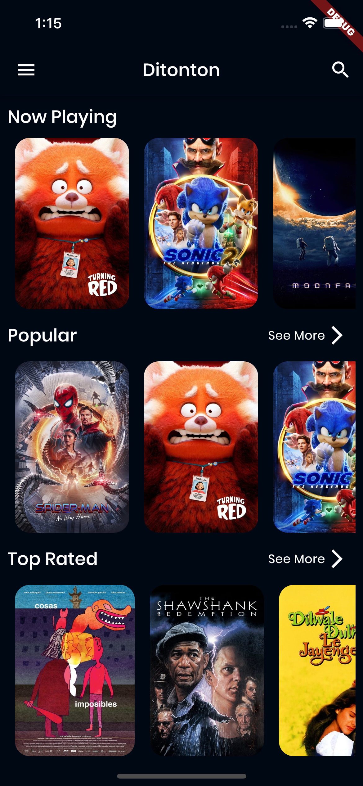

<h1 align="center">
  Ditonton
</h1>

  Submission Flutter Expert in Dicoding Course.

  
  
  
  
  
  

  

## Features

- Movie
- Tv Show
- Search Movie & Tv Show
- Watchlist Movie & Tv Show
- Recommendation
